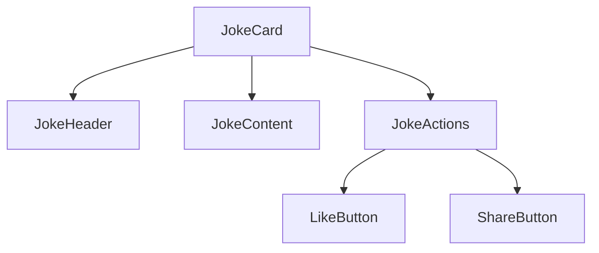

# 系统模式

## 架构概览
项目采用组件化架构，以React函数式组件为基础，结合TypeScript和TailwindCSS构建现代化UI组件。

## 设计模式
1. **组件模式**
   - 采用受控组件模式
   - 使用组合优于继承原则
   - 实现高度可配置的Props接口

2. **状态管理**
   - 使用React Hooks管理本地状态
   - 采用状态提升模式处理组件间通信

3. **样式方案**
   - 使用TailwindCSS实现原子化CSS
   - 支持主题切换的设计系统
   - 响应式设计模式

## 组件关系


## 技术决策
1. **使用TypeScript**
   - 提供类型安全
   - 改善开发体验
   - 便于维护和重构

2. **选择TailwindCSS**
   - 提高开发效率
   - 确保样式一致性
   - 优化打包体积

3. **采用@heroicons/react**
   - 提供高质量图标
   - 保持设计一致性
   - 支持主题切换

## 代码组织
```
src/
  components/
    JokeCard/
      index.tsx
      types.ts
      JokeHeader.tsx
      JokeContent.tsx
      JokeActions.tsx
  hooks/
    useTheme.ts
    useLike.ts
    useShare.ts
  utils/
    theme.ts
    share.ts
``` 